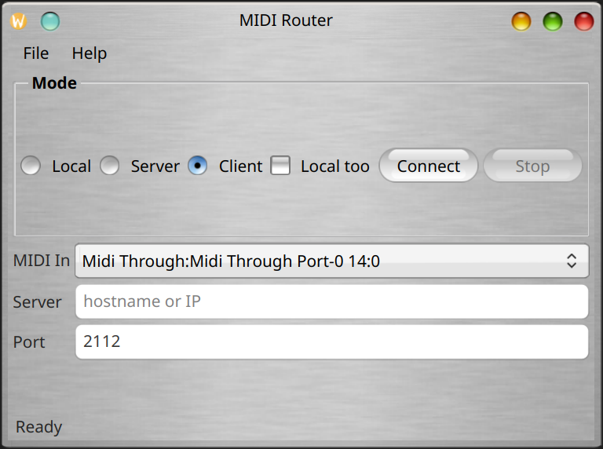
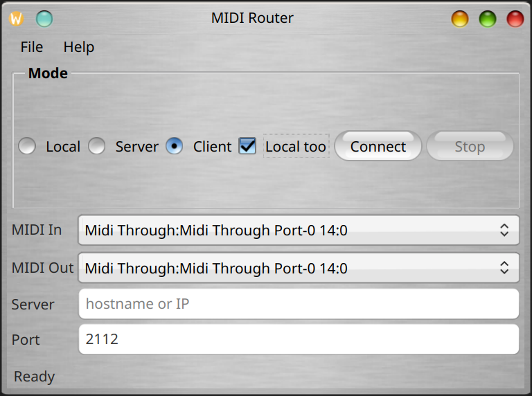
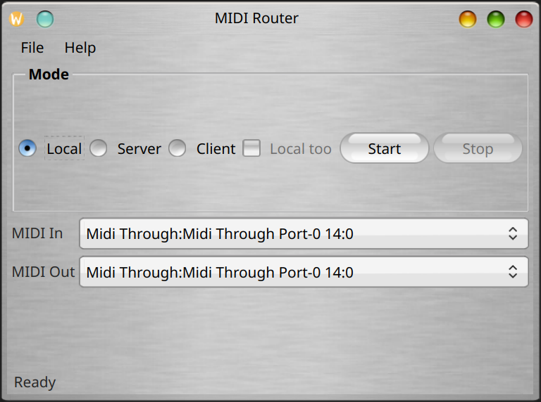
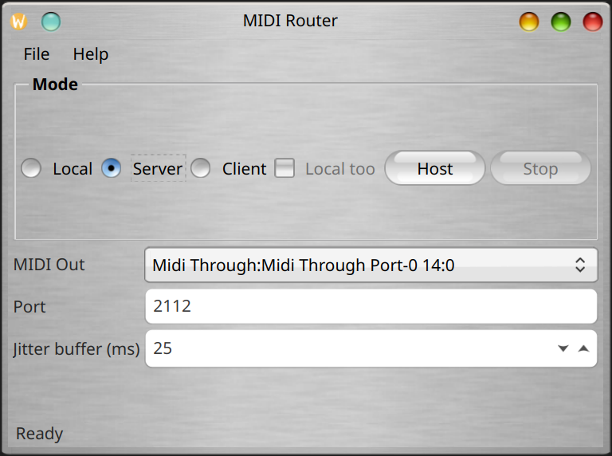

# MIDIRouter

This is a desktop application that routes MIDI between ports on one machine (**Local**) or over TCP (**Server** / **Client**).

Network transport uses timestamped packets: the client stamps each message with `std::chrono::steady_clock` nanoseconds; the server schedules MIDI output relative to the first packet in a session and a configurable **jitter buffer**, preserving inter-onset timing despite variable packet delay.

The GUI uses **Qt 6**. MIDI I/O uses **RtMidi**. The codebase targets **C++17**.

Historical **wxWidgets** sources (2008) are preserved under [`code/legacy_wx`](code/legacy_wx/README.txt) for reference only.

## Screenshots
<p align="center">
	<a href="screenshots/MIDIRouter-Client.png" target='_blank'></a>
	<a href="screenshots/MIDIRouter-ClientLocal.png" target='_blank'></a>
	<a href="screenshots/MIDIRouter-Local.png" target='_blank'></a>
	<a href="screenshots/MIDIRouter-Server.png" target='_blank'></a>
</p>


## Build requirements

- CMake 3.16+
- Qt 6 (Core, Gui, Widgets, Network)
- RtMidi library and headers
- C++17 compiler

### Linux

```bash
sudo apt-get install build-essential cmake ninja-build qt6-base-dev librtmidi-dev pkg-config
make           # or: cmake -S . -B build && cmake --build build --parallel
```

### macOS (Homebrew example)

```bash
brew install cmake ninja qt@6 rtmidi pkgconf
export CMAKE_PREFIX_PATH="$(brew --prefix qt@6);$(brew --prefix)"
cmake -S . -B build -GNinja -DCMAKE_BUILD_TYPE=Release
cmake --build build --parallel
```

### Windows

See [`vs/README_VS2022.md`](vs/README_VS2022.md): open the root **`CMakeLists.txt`** in Visual Studio with the CMake workload, or generate a Visual Studio solution with CMake (CMake sets `binaryDir` under **`vs/`** when using the `vs2022-x64` preset in [`CMakePresets.json`](CMakePresets.json)).

MSYS2 (MINGW64) packages used in CI: `mingw-w64-x86_64-qt6-base`, `mingw-w64-x86_64-cmake`, `mingw-w64-x86_64-ninja`, `mingw-w64-x86_64-rtmidi`.

## Running

Connect client to server using the configured TCP port (default **2112**).

- **Server**: choose MIDI Out, set port, click **Host**, wait for client.
- **Client**: choose MIDI In, optional **Local too** + MIDI Out, set host/IP and port, click **Connect**.
- Adjust **Jitter buffer (ms)** on the server (default **25 ms**) so scheduling stays ahead of worst-case jitter; higher values increase latency but improve stability on busy networks.

## Specifications

[MIDI specifications](https://midi.org/specs) (message formats are unchanged; timing over IP is handled by this app’s buffering and timestamps rather than by the MIDI wire protocol alone.)
