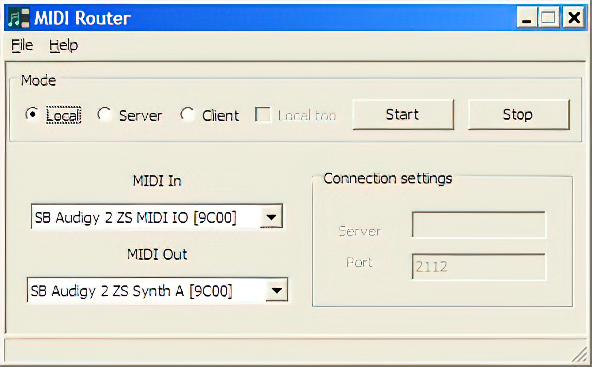
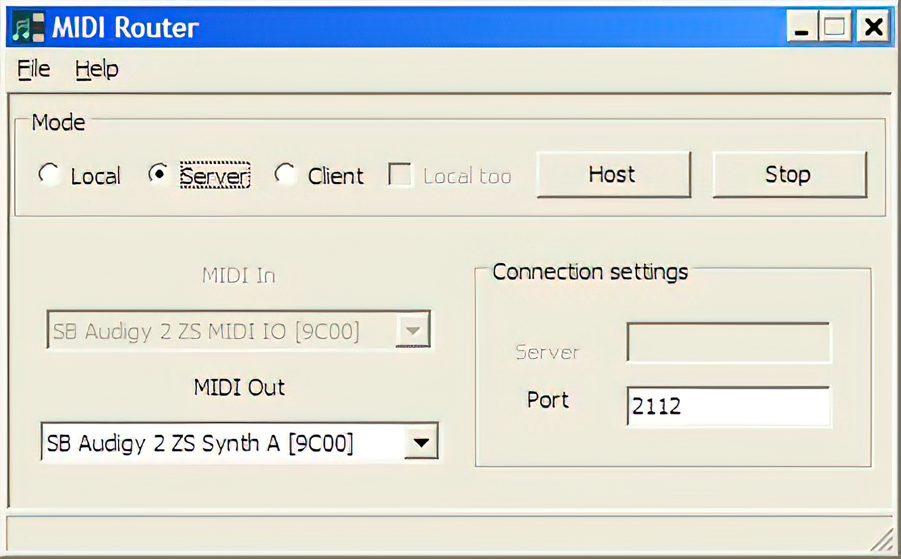
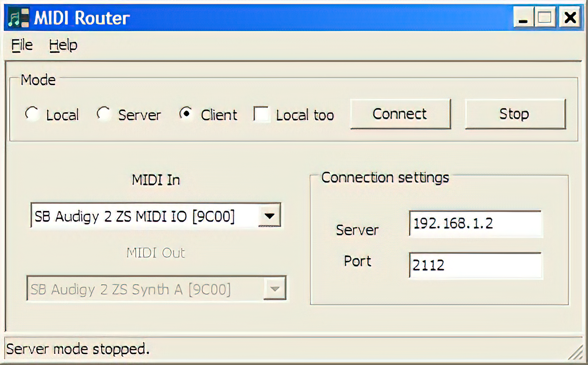
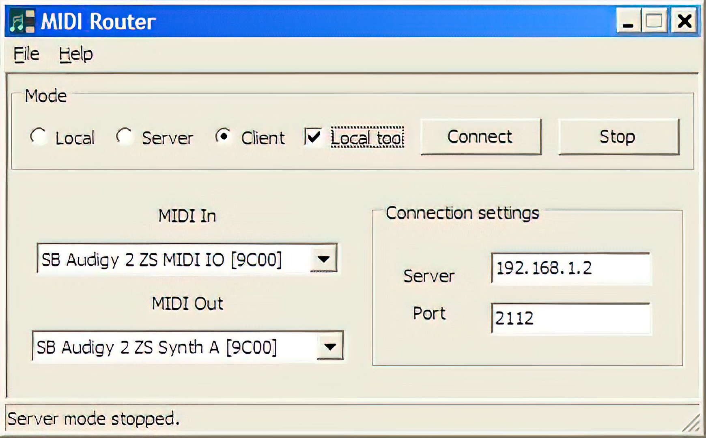

# MIDIRouter
This is an application that routes MIDI data from a MIDI input port to a MIDI output port.  MIDI Router can
also send MIDI data over a network to another computer.  Routing over a network was the main goal of this
program and was done as a test to see how feasible it would be to send MIDI messages over a network in real-time.
It's definitely possible, as this application shows, but I found that the MIDI messages sent across the network
often don't arrive at the right time, since timing of packets is not guaranteed.  But I thought it was at
least a fun concept.

The application has 3 modes: Local, Server, and Client.  In Local mode, the application routes MIDI from a
MIDI input on your computer to a MIDI output on your computer.  To send MIDI over a network, first run the
application in Server mode on the computer on which you want to output MIDI and click "Host".  Then, run the
application in client mode, enter the host computer's server & port, and click "Connect".  The application
should connect, allowing you to send MIDI data to the host computer, which will output the MIDI to its
selected MIDI Out port.  In Client mode, there is an option to also output MIDI to a local MIDI port.

Acknowledgement and thanks goes to Gary P. Scavone for his RtMidi C++ class, which provides the C++ interface
to the MIDI hardware.  This code uses an old version of RtMidi; it appears that RtMidi is currently
<a href='https://github.com/thestk/rtmidi' target='_blank'>on GitHub</a>; there's a comment in the included
RtMidi.cpp with <a href='http://music.mcgill.ca/~gary/rtmidi/' target='_blank'>this URL</a>, but it looks
like that no longer exists.

I wrote this in 2008.  I used <a href='https://wxwidgets.org' target='_blank'>wxWidgets</a> for the GUI, thinking I
would build executables for multiple operating systems, but I only built a Windows version.  Also, since I wrote
this in 2008, the code doesn't take advatnage of modern C++.  If I were to re-write this again now, one change I
would make would be to use the threading libraries that are now included in the C++ standard library as of C++11
(such as <a href='https://cplusplus.com/reference/thread/thread/' target='_blank'>std::thread</a>; currently, this
source code uses <a href='https://docs.wxwidgets.org/3.2/classwx_thread.html' target='_blank'>wxThread</a>, which
is provided by wxWidgets and provided cross-platform threading capability; note that even the wxThread
documentation now recommends using std::thread in C++11 programs).

Also, for networking, this uses classes provided by wxWidgets, such as
<a href='https://docs.wxwidgets.org/3.3/classwx_socket_server.html' target='_blank'>wxSocketServer</a>,
<a href='https://docs.wxwidgets.org/3.3/classwx_socket_event.html' target='_blank'>wxSocketEvent</a>, and
<a href='https://docs.wxwidgets.org/3.2/classwx_socket_client.html' target='_blank'>wxSocketClient</a>. if I
re-wrote this application now, I would probably choose a different networking library.

## Screenshots

	Local mode:
	
	Server mode:
	
	Client mode:
	
	Client mode with local MIDI output:
	

